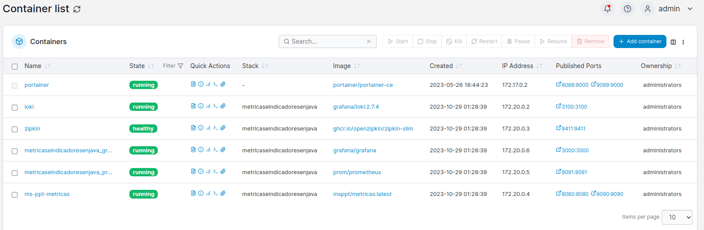
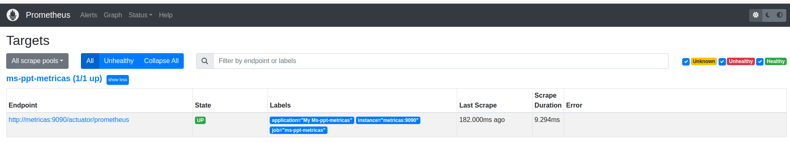
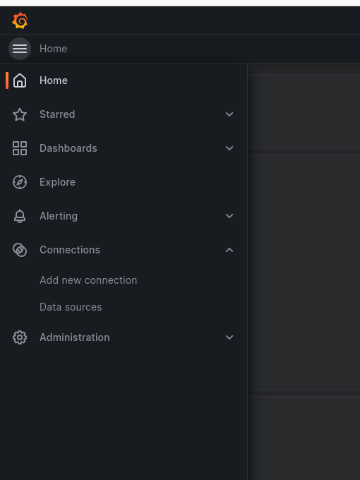
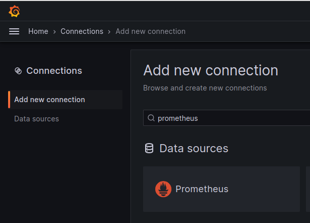
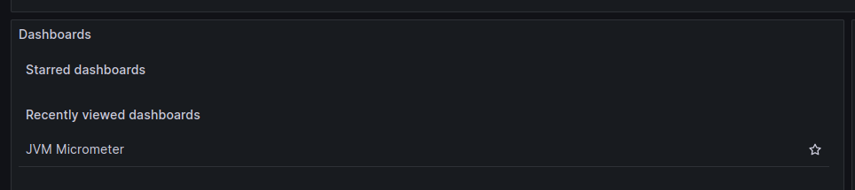
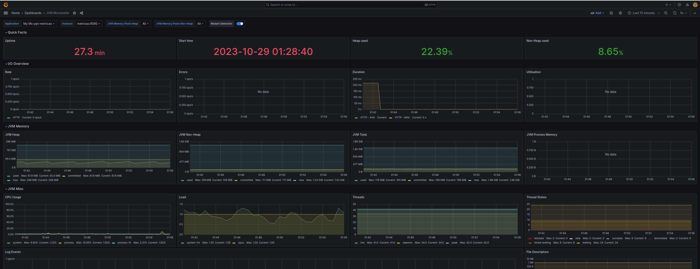
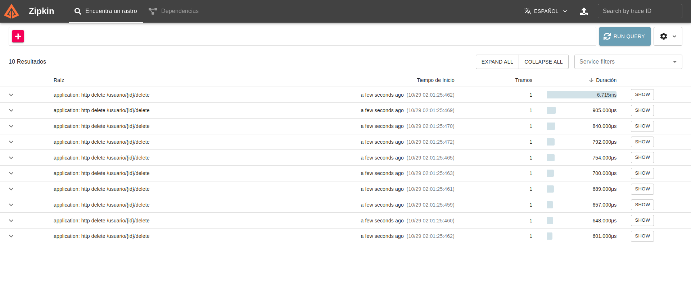

# Metricas e Indicadores

En esta presentación revisaremos una aplicacion construida en Spring Boot con varios extras pensando en metricas he indicadores.


{:height="36px" width="36px"}.
 
1.- El Primer paso es compilar el proyecto ms-ppt-metricas en java con el build.sh y luego con ./buildDocker.sh para generar la imagen.

2.- En la raiz del proyecto
	
	
3.- Revisamos los contenedores en este caso estoy utilizando portainer.io si no lo tienen pueden ejecuta "docker ps -a"
	

4.- Configurar archivo hosts.
```
vim /etc/hosts

# Agregar la linea :
127.0.0.1       metricas

```
	
5.- Verficar aplicacion java
Listar todos los usuarios.
	http://0.0.0.0:8080/ms-ppt-metricas/usuario/
Puerto de las metricas
	http://0.0.0.0:9090/actuator

6.- Verficar que Prometheus tenga comunicación con nuestra aplicación java. Vamos a la URL "http://0.0.0.0:9091/" seleccionamos /Status/Target y debemos entontrarnos con la aplicación como se muestra en la imagen.
	
	
7.- Grafana en "http://0.0.0.0:3000" los logeamos con "admin/admin" y nos solicita ingresar una nueva contraseña.

Seleccionamos en "Home"
	

Vamos a "Add new connection" y seleccionamos Prometheus luego Create new Dashboards.
	
	
En el "Home" vamos a dashboards y seleccionamos JVM Micrometer
	

Hecho esto ya tenemos desplegadas las metricas.
	
	
8.- zipkin - http://0.0.0.0:9411/zipkin
	
	

