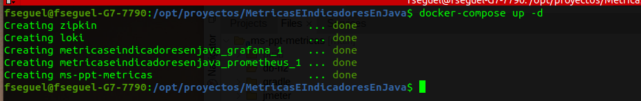

# Metricas e Indicadores

En esta presentación revisaremos una aplicacion construida en Spring Boot con varios extras pensando en metricas he indicadores.


1.- El Primer paso es compilar el proyecto ms-ppt-metricas en java con el build.sh y luego con ./buildDocker.sh para generar la imagen.

2.- En la raiz del proyecto
	
	
3.- Revisamos los contenedores en este caso estoy utilizando portainer.io si no lo tienen pueden ejecuta "docker ps -a"
	

4.- Configurar archivo hosts.
```
vim /etc/hosts

# Agregar la linea :
127.0.0.1       metricas

```
	
5.- Verficar aplicacion java
Listar todos los usuarios.
	http://0.0.0.0:8080/ms-ppt-metricas/usuario/
Puerto de las metricas
	http://0.0.0.0:9090/actuator

6.- Prometheus
	
